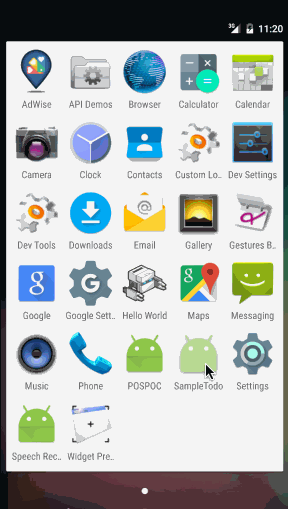

# SampleTodo App demo

This is an Android application to create, retrieve, update and delete to do items.

Time Spent: **4** hours spent in total

Completed User Stories

* [x] Required: User can add new to do items.
* [x] Required: User can retrieve created to do items.
* [x] Required: User can edit the existing to do items.
* [x] Required: User can delete the created to do items.
* [x] Additional: All the records are stored in SQLite database using ActiveAndroid library.

Notes:

Application validates if to do item is empty and shows error message saying to do item can not be empty

Walkthrough of all user stories:

GIF created with [LiceCap](http://www.cockos.com/licecap/).
    
    
